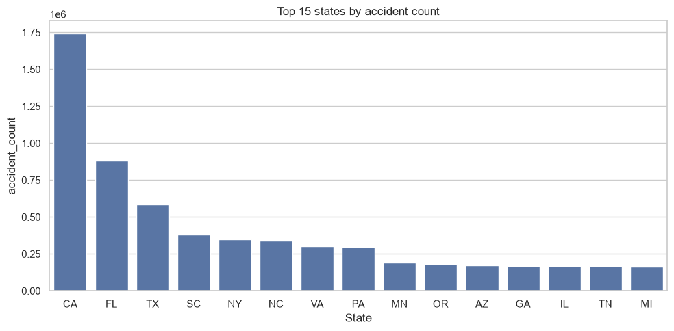
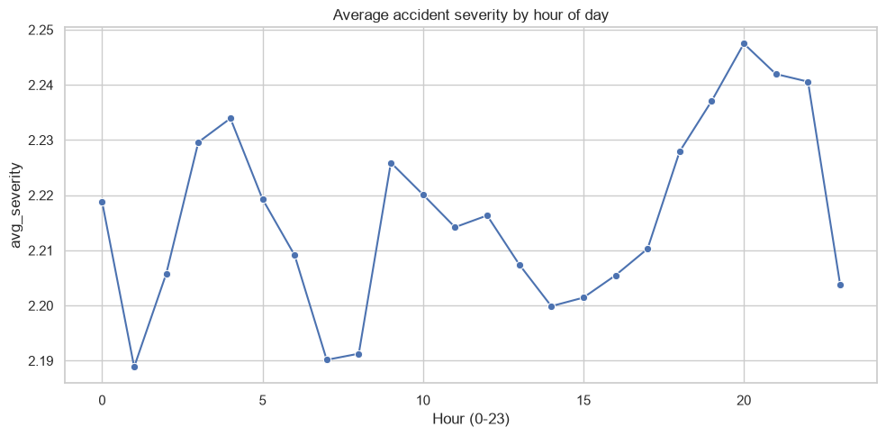

# US Accidents (2016-2023): Comprehensive Statistical Analysis Report

Data Analyst/BI portfolio project. This report pulls together the
project methodology, the data dictionary, the full analysis notebook
(code, narrative, and the actual results it produced), the findings, and
the reasoning behind each major decision made along the way. For the
short version, see `executive_summary.md` / `executive_summary.pdf`.

## Table of contents

1. [Project overview](#project-overview)
2. [Methodology](#methodology)
3. [Data dictionary](#data-dictionary)
4. [Full analysis](#full-analysis)
5. [Findings summary](#findings-summary)
6. [Project decisions](#project-decisions)
7. [Dashboard and live demo](#dashboard-and-live-demo)
8. [Conclusion](#conclusion)

---

## Project overview

This is a statistical analysis of about 7.7 million US traffic accident
records from 2016 to 2023. The question was straightforward: what
actually drives accident severity? Does weather matter? Time of day?
What about road features like junctions and stop signs? Hypothesis
testing and logistic regression were used to answer that, and an
interactive dashboard was built on top so the results are easy to
explore rather than buried in a notebook. The full scope, data pipeline,
statistical analysis, dashboard, automated tests, CI/CD, and live
deployment, was all built for this project.

---

## Methodology

### Data acquisition

The dataset was downloaded by hand from the
[Kaggle dataset page](https://www.kaggle.com/datasets/sobhanmoosavi/us-accidents)
rather than through the Kaggle API, so no API credentials were needed. It
landed at `data/raw/US_Accidents_March23.csv`, about 3.06GB and 7.7
million rows. The reasoning for skipping the API is covered in the
Project Decisions section below.

### Processing pipeline

1. `us_accidents.ingest.load_raw` registers the CSV as a DuckDB view
   without loading it into memory.
2. `us_accidents.ingest.validate_schema` checks that the columns listed
   in the Data Dictionary (below) are actually present.
3. `us_accidents.aggregate` produces two kinds of output:
   - Group-by rollups (by state, weather, hour, year) for the dashboard
     and descriptive statistics.
   - A 200,000-row reproducible random sample (seed 42) for hypothesis
     testing and regression. Full-dataset granularity isn't needed for
     valid inference at this scale.
4. Everything gets written to `data/processed/` as Parquet, plus a JSON
   summary of the regression results, and all of it is committed to git.
   These are small, derived files, unlike the raw CSV.

Run via: `uv run python scripts/build_aggregates.py`

### Development environment note

One quirk worth mentioning: the project sits on an external drive
formatted as exFAT, which doesn't support filesystem hardlinks. That
means `uv sync` has to do full file copies instead of the usual
near-instant hardlinks, so installs and reinstalls run slower than
they would on an NTFS drive. It doesn't affect correctness, only speed,
so this was accepted as a known tradeoff rather than moving the whole
project to work around it.

---

## Data dictionary

Source:
[US Accidents (2016-2023)](https://www.kaggle.com/datasets/sobhanmoosavi/us-accidents)
by Sobhan Moosavi. The table below covers only the columns this analysis
actually uses; the raw file has 46 columns in total.

| Column | Type | Meaning |
|---|---|---|
| Severity | int (1-4) | Impact on traffic, 1 = least, 4 = most severe |
| Start_Time | timestamp | When the accident began |
| State | string | US state abbreviation |
| Weather_Condition | string | Weather at the time of the accident |
| Temperature(F) | float | Temperature in Fahrenheit |
| Visibility(mi) | float | Visibility in miles |
| Junction | bool | Whether the accident occurred near a road junction |
| Crossing | bool | Whether the accident occurred near a crossing |
| Traffic_Signal | bool | Whether a traffic signal was present nearby |
| Stop | bool | Whether a stop sign was present nearby |
| Sunrise_Sunset | string | "Day" or "Night" at the time of the accident |

---

## Full analysis

What follows is the analysis notebook itself
(`notebooks/01_eda_and_hypothesis_testing.ipynb`), reproduced directly
rather than summarized: the code, the narrative, and the real output it
produced when run.

### US Accidents (2016-2023): Exploratory Analysis & Hypothesis Testing

Data Analyst/BI portfolio project.

```python
"""Setup: load the pre-aggregated Parquet files produced by
scripts/build_aggregates.py. This notebook never touches the raw
3GB CSV directly.
"""
import matplotlib.pyplot as plt
import pandas as pd
import seaborn as sns

from us_accidents.stats_tests import (
    anova_severity_by_hour,
    chi_square_severity_by_weather,
    logistic_regression_high_severity,
)

by_state = pd.read_parquet("../data/processed/by_state.parquet")
by_weather = pd.read_parquet("../data/processed/by_weather.parquet")
by_hour = pd.read_parquet("../data/processed/by_hour.parquet")
sample = pd.read_parquet("../data/processed/sample_for_stats.parquet")

sns.set_theme(style="whitegrid")
```

#### Descriptive EDA

```python
fig, ax = plt.subplots(figsize=(10, 5))
top_states = by_state.head(15)
sns.barplot(data=top_states, x="State", y="accident_count", ax=ax)
ax.set_title("Top 15 states by accident count")
plt.tight_layout()
plt.savefig("../report/fig_top_states.png", dpi=150)
plt.show()
```



```python
fig, ax = plt.subplots(figsize=(10, 5))
sns.lineplot(data=by_hour, x="hour", y="avg_severity", marker="o", ax=ax)
ax.set_title("Average accident severity by hour of day")
ax.set_xlabel("Hour (0-23)")
plt.tight_layout()
plt.savefig("../report/fig_severity_by_hour.png", dpi=150)
plt.show()
```



#### H1: Severity vs. weather condition

```python
"""H1: Accident severity is associated with weather condition."""
chi2_result = chi_square_severity_by_weather(sample)
print(
    f"Chi-square = {chi2_result['statistic']:.2f}, "
    f"p = {chi2_result['p_value']:.4g}, "
    f"df = {chi2_result['dof']}"
)
chi2_finding = (
    f"Severity IS significantly associated with weather condition "
    f"(chi-square = {chi2_result['statistic']:.2f}, p = {chi2_result['p_value']:.4g})."
    if chi2_result["significant"]
    else
    f"No significant association found between severity and weather "
    f"condition (chi-square = {chi2_result['statistic']:.2f}, p = {chi2_result['p_value']:.4g})."
)
print(chi2_finding)
```

```
Chi-square = 9674.69, p = 0, df = 276
Severity IS significantly associated with weather condition (chi-square = 9674.69, p = 0).
```

*(Note: the true p-value underflows to 0 given the sample size and effect
size. It's reported as p < 0.0001 elsewhere in this report instead of a
literal 0.)*

#### H2: Severity vs. hour of day

```python
"""H2: Mean accident severity differs by hour of day."""
anova_result = anova_severity_by_hour(sample)
anova_finding = (
    f"Mean severity DOES differ significantly by hour of day "
    f"(F = {anova_result['statistic']:.2f}, p = {anova_result['p_value']:.4g})."
    if anova_result["significant"]
    else
    f"No significant difference in mean severity across hours of day "
    f"(F = {anova_result['statistic']:.2f}, p = {anova_result['p_value']:.4g})."
)
print(anova_finding)
```

```
Mean severity DOES differ significantly by hour of day (F = 9.83, p = 2.797e-35).
```

#### Predictors of high-severity accidents (logistic regression)

```python
"""Logistic regression: which road/weather/time features predict a
high-severity accident (Severity >= 3)?
"""
sample["High_Severity"] = (sample["Severity"] >= 3).astype(int)
feature_cols = ["Junction", "Crossing", "Traffic_Signal", "Stop"]
sample[feature_cols] = sample[feature_cols].astype(float)

logit_result = logistic_regression_high_severity(sample, feature_cols)

logit_findings = []
for feature in feature_cols:
    odds = logit_result["odds_ratios"][feature]
    p = logit_result["p_values"][feature]
    lower, upper = logit_result["conf_int"][feature]
    direction = "increases" if odds > 1 else "decreases"
    sig = "significant" if p < 0.05 else "not significant"
    line = (
        f"{feature}: odds ratio = {odds:.2f} (95% CI [{lower:.2f}, {upper:.2f}]), "
        f"p = {p:.4g} ({sig}). Presence of {feature} {direction} the odds "
        f"of a high-severity accident."
    )
    logit_findings.append(line)
    print(line)
pseudo_r2_line = f"Pseudo R-squared: {logit_result['pseudo_r2']:.4f}"
print(pseudo_r2_line)
```

```
Junction: odds ratio = 1.34 (95% CI [1.29, 1.39]), p = 9.946e-49 (significant). Presence of Junction increases the odds of a high-severity accident.
Crossing: odds ratio = 0.41 (95% CI [0.39, 0.44]), p = 5.143e-208 (significant). Presence of Crossing decreases the odds of a high-severity accident.
Traffic_Signal: odds ratio = 0.54 (95% CI [0.52, 0.57]), p = 2.85e-165 (significant). Presence of Traffic_Signal decreases the odds of a high-severity accident.
Stop: odds ratio = 0.30 (95% CI [0.27, 0.34]), p = 8.005e-99 (significant). Presence of Stop decreases the odds of a high-severity accident.
Pseudo R-squared: 0.0243
```

---

## Findings summary

These numbers come from a reproducible 200,000-row sample (seed 42) of
the full 7.7 million-row dataset.

### H1: Severity vs. weather condition

Severity is significantly associated with weather condition
(chi-square = 9674.69, df = 276, p < 0.0001).

### H2: Severity vs. hour of day

Mean severity does differ by hour of day
(F = 9.83, p = 2.797e-35).

### Predictors of high-severity accidents (logistic regression)

Target: `High_Severity` (Severity >= 3). All four road-feature
predictors turned out to be statistically significant.

- **Junction**: odds ratio 1.34 (95% CI [1.29, 1.39]), p = 9.946e-49.
  Being near a junction *increases* the odds of a high-severity accident.
- **Crossing**: odds ratio 0.41 (95% CI [0.39, 0.44]), p = 5.143e-208.
  Being near a crossing *decreases* the odds.
- **Traffic_Signal**: odds ratio 0.54 (95% CI [0.52, 0.57]), p = 2.85e-165.
  Being near a traffic signal *decreases* the odds.
- **Stop**: odds ratio 0.30 (95% CI [0.27, 0.34]), p = 8.005e-99.
  Being near a stop sign *decreases* the odds, and by the largest margin
  of the four.

Pseudo R-squared: 0.0243. That's low, and it should be. These four road
features alone only explain a small slice of what drives severity.
Weather and time of day (H1, H2) clearly matter too, and neither is part
of this particular model.

---

## Project decisions

### Dataset: US Accidents (2016-2023)

Picked for its scale (about 7.7M rows) and how well-known it is, while
still staying manageable in a few days by leaning on DuckDB and
aggregation instead of loading everything into pandas.

### DuckDB for querying, not a hosted database

DuckDB is an embedded analytical engine. It queries the CSV directly off
local disk, no server or upload required. A hosted database (Render's
free Postgres, for example) was considered and ruled out: the free-tier
storage cap is too small for the raw file, free databases expire unless
you upgrade to paid, and a row-store like Postgres is the wrong tool for
bulk analytical aggregation compared to DuckDB's columnar execution. The
dashboard doesn't need the raw data anyway. It only reads small,
pre-aggregated Parquet files.

### Manual dataset download instead of the Kaggle API

Simpler for a project this size. It avoids needing Kaggle API
credentials or a `.env` file just for a one-time download.

### Separate GitHub account (`dsamy-byte`)

Kept fully isolated from any personal GitHub account. Git identity is
set at the repo level only, no `--global` changes, and a dedicated SSH
key with a host alias (`github.com-dsamy-byte`) means this repo
authenticates as the right account automatically through its remote URL.

### Render over Streamlit Community Cloud

Render hosts the dashboard as a web service and deploys automatically
from GitHub on every push to `main`.

### Render's native Python runtime, not Docker

No Dockerfile. `render.yaml` uses `runtime: python` with a plain build
and start command. It's simpler, there's nothing extra to maintain, and
the dashboard has no dependency (like DuckDB) that actually needs to run
at deploy time. It just reads pre-built Parquet files with pandas.

### Reports built incrementally

The reports were updated at the end of each project phase rather than
written only at the very end, so there was always something presentable
on hand, even if the project had been paused partway through.

---

## Dashboard and live demo

The interactive Streamlit dashboard covers:

- A US map of accident counts by state, plus a top-20 state bar chart.
- A year-over-year trend of accident counts, 2016 through 2023.
- Cross-filterable weather-condition and hour-of-day breakdowns. Pick a
  state and/or year and both charts update to that slice of the data.
- A key drivers panel that surfaces the logistic regression findings
  (odds ratios with confidence intervals) right in the dashboard, not
  just buried in the notebook.

**Live dashboard**: https://us-accident-analysis-dashboard.onrender.com

Note that Render's free tier sleeps after inactivity, so the first load
can take about 30 seconds to wake up.

Run it locally with `uv run streamlit run dashboard/app.py`.

---

## Conclusion

This project is meant to show what an end-to-end Data Analyst/BI
workflow actually looks like: scalable data processing with DuckDB on a
real 7.7 million-record dataset, real statistical inference (hypothesis
testing and logistic regression with effect sizes that are actually
interpreted, not just reported) rather than surface-level description,
and a deployed, interactive way for someone else to explore the results
themselves. Automated tests and CI/CD keep the whole thing reproducible.

**Project repository**: https://github.com/dsamy-byte/us-accident-analysis
